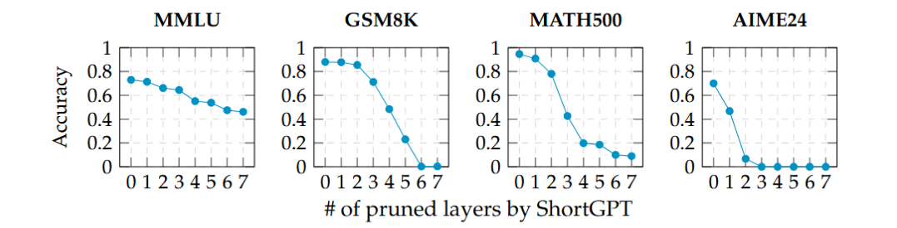
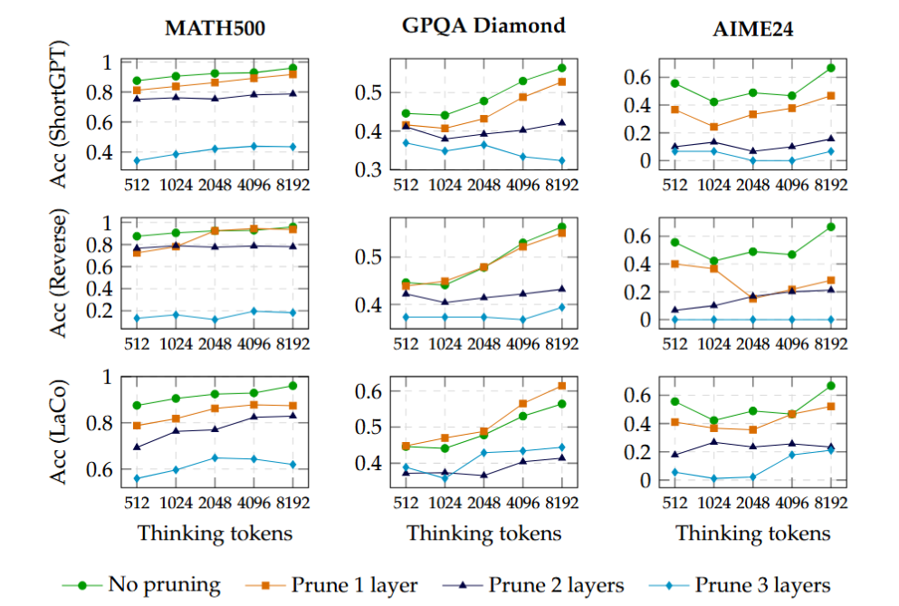

# When Fewer Layers Break More Chains: Layer Pruning Harms Test-Time Scaling in LLMs

<p align="center">
  <a href="https://arxiv.org/pdf/2510.22228">
    
  </a>
</p>

This repo contains the official codebase of **Layer Pruning Harms Test-Time Scaling**, which has been accepted by **COLM 2026**

Layer pruning boosts LLM efficiency but its impact on long-chain reasoning is unexplored. Ignoring this can falsely suggest "lossless" pruning while causing severe reasoning failures:

<div align="center">
  
</div>

We study how layer pruning degrades reasoning through the lens of test-time scaling. We find that  even removing 1–2 layers causes drastic performance drops on test-time scaling capacity:

<div align="center">
  
</div>


Our analysis reveals that  why such scaling and reasoning capacity is fragile under layer pruning and supervised fine-tuning cannot restore pruned models' lost test-time scaling, challenging "lossless pruning" claims and urging careful evaluation before deploying pruned LLMs for reasoning tasks.


## Structure
```
├── lib/                     # Pruning strategies implementation
├── eval/                    # Sequential & parallel test-time scaling evaluation
├── train/                   # LoRA and Full fine-tuning implementation
├── analysis/                # Model output analysis scripts
└── main.py                  # Pruning and model saving entry point
```

## Install
```
conda create -n layerpruning python==3.10 -y
conda activate layerpruning
pip install -r requirements.txt
pip install -e eval/lm-evaluation-harness/
```

## Usage
### Pruning
#### ShortGPT Pruning
```
python main.py \
    --model Qwen/Qwen3-8B \
    --prune_method shortgpt \
    --seed 0 \
    --remove_n_layers 3 \
    --n_samples 1000 \
    --max_seq_len 1024 \
    --batch_size 8
```

#### Reverse-order prune
```
python main.py \
    --model Qwen/Qwen3-8B \
    --prune_method tail \
    --seed 0 \
    --remove_n_layers 3 \
```

#### LaCo
Adjust `laco_threshold` to merge certain number of layers.
```
python main.py \
    --model Qwen/Qwen3-8B \
    --prune_method laco \
    --calibration_data laco \
    --laco_merge_layers 2 \
    --seed 0 \
    --laco_threshold 0.9
```

#### Selection
You can also specify the layer index you want to prune by:
```
python main.py \
    --model Qwen/Qwen3-8B \
    --prune_method selection \
    --seed 0 \
    --layers_to_remove 25 27 26
```

### Evaluation
Input the model path and output path in ./eval/eval_sequential_scaling.sh and ./eval/eval_parallel_scaling.sh
```
sh ./eval/eval_sequential_scaling.sh
sh ./eval/eval_parallel_scaling.sh
```

### Analysis
We provide an example sampled from output of `s1.1-7B` model on `AIME24` dataset.
To run analyse on diversity, just use:
```
python ./analysis/diversity.py --jsonl_path ./analysis/example/s1.1-7B_aime24.jsonl
```
To run analyse on self-reflection, use:
```
python ./analysis/self_reflection.py --jsonl_path ./analysis/example/s1.1-7B_aime24.jsonl --max_samples 200
```

## Citation
```
@inproceedings{wang2025fewer,
  title={When Fewer Layers Break More Chains: Layer Pruning Harms Test-Time Scaling in LLMs},
  author={Wang, Keyu and Lyu, Tian and Su, Guinan and  Yin, Lu and Canini, Marco and Geiping, Jonas and Liu, Shiwei},
  booktitle={Proceedings of the Conference on Language Modeling (COLM)},
  year={2026},
  address={San Francisco, CA},
  month={October}
}
```

## Acknowledgement
This repository is build upon the [Wanda](https://github.com/locuslab/wanda), [lm-eval-harness](https://github.com/EleutherAI/lm-evaluation-harness) and [s1](https://github.com/simplescaling/s1) repositories. Thanks for their great work!
